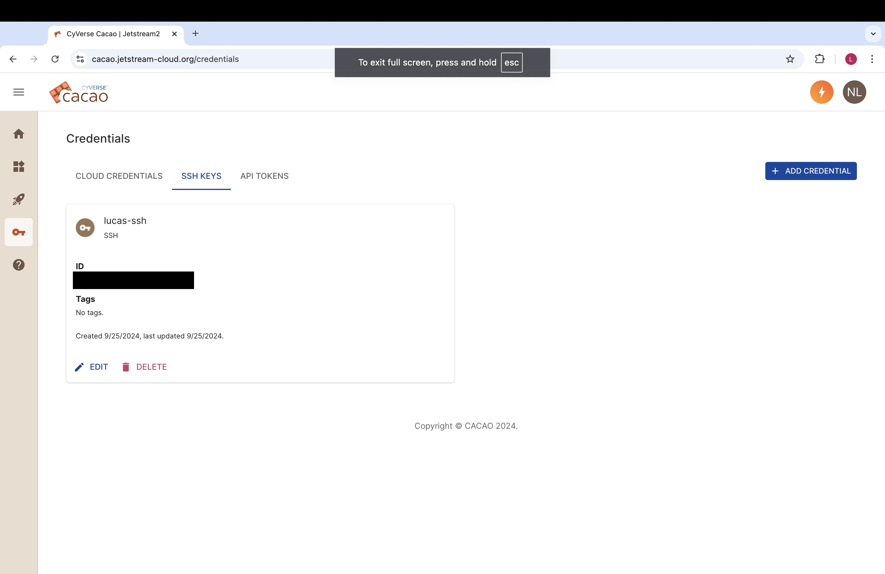
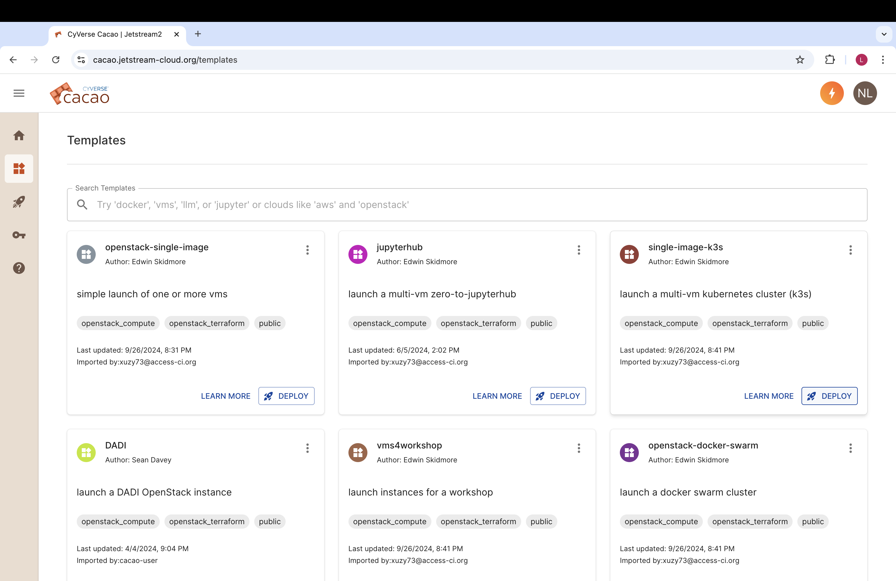
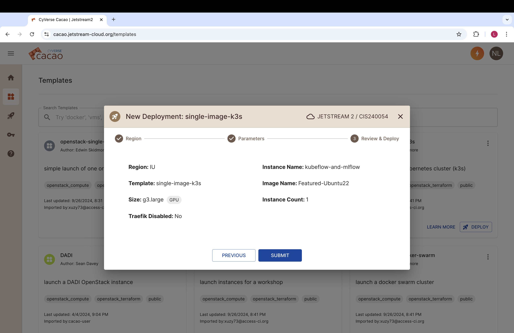
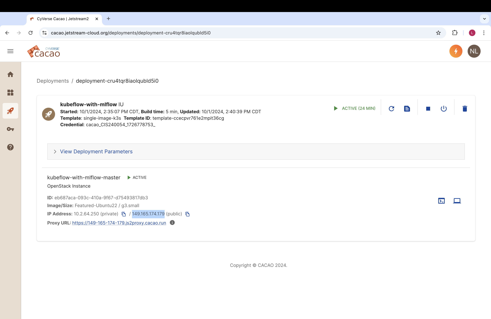

# Tutorial 4 - Kubeflow + MLFlow


## Jetstream Setup
At https://cacao.jetstream-cloud.org/, if you haven't, choose Credentials on the left menu, go to the SSH Keys tab and add your public SSH key:



<br />

Then, choose Templates on the left menu and create a `single-image-k3s` project:



<br />

Choose `Featured-Ubuntu-22` for Image Name, `g3.large` for size (anything smaller than that won't be able to run Kubeflow), and give a name to your instance:



<br />
You can now go to Deployments on the left menu and wait for the instance build to finish. When it does, click on the instance and copy its public IP address:



<br />
You can now connect to the instance by opening a terminal and running:

```sh
ssh localhost:8080:127.0.0.1:8080 <username>@<ip-address>
```
Adding `localhost:8080:127.0.0.1:8080` will allow you to connect a local port from your pc (in this case localhost:8080) to a port from the server (in this case 127.0.0.1:8080, which will be running the Kubeflow dashboard).

## Kubeflow Setup
Now that you are connected to the server, you can install Kubeflow. The instructions below are an adaptation of the ones found at the [Kubeflow manifests repository](https://github.com/kubeflow/manifests).

Start by configuring some pre-requisites (downloading kind, kustomize, and changing Linux kernel subsystem to support many pods)
```sh
sudo snap install kustomize
[ $(uname -m) = x86_64 ] && curl -Lo ./kind https://kind.sigs.k8s.io/dl/v0.24.0/kind-linux-amd64
chmod +x ./kind
sudo mv ./kind /usr/local/bin/kind
sudo sysctl fs.inotify.max_user_instances=2280
sudo sysctl fs.inotify.max_user_watches=1255360
```

<br />
Create the necessary permissions to create the kind cluster. Then, log out and log back in for the changes to take effect.

```sh
sudo usermod -aG docker $USER
```

<br />
Now, create the kind cluster:

```sh
sudo cat <<EOF | kind create cluster --name=kubeflow --config=-
kind: Cluster
apiVersion: kind.x-k8s.io/v1alpha4
nodes:
- role: control-plane
  image: kindest/node:v1.31.0@sha256:53df588e04085fd41ae12de0c3fe4c72f7013bba32a20e7325357a1ac94ba865
  kubeadmConfigPatches:
  - |
    kind: ClusterConfiguration
    apiServer:
      extraArgs:
        "service-account-issuer": "kubernetes.default.svc"
        "service-account-signing-key-file": "/etc/kubernetes/pki/sa.key"
EOF
```

<br />
Save the generated kubeconfig:

```sh
kind get kubeconfig --name kubeflow > /tmp/kubeflow-config
export KUBECONFIG=/tmp/kubeflow-config
```

<br />

Create a Secret based on existing credentials in order to pull the images. Replace `<username>` with your Jetstream username.

```sh
docker login

kubectl create secret generic regcred \
    --from-file=.dockerconfigjson=/home/<username>/.docker/config.json \
    --type=kubernetes.io/dockerconfigjson
```

<br />
Now, download the official Kubeflow manifests:

```sh
git clone https://github.com/kubeflow/manifests.git
cd manifests
```

<br />
Finally, install all Kubeflow official components. You need the while loop because some steps will fail, but this behavior is expected and the same steps will work the following time. Usually, the command will run about 5 times before everything works successfully.

```sh
while ! kustomize build example | kubectl apply -f -; do echo "Retrying to apply resources"; sleep 20; done
```

<br >
You can now expose the Kubeflow portal by running the command below:

```sh
kubectl port-forward svc/istio-ingressgateway -n istio-system 8080:80
```

If you now open localhost:8080 no your local machine, you will be able to see Kubeflow's sign in page. The default user is `user@example.com` and the default password is `12341234`.

## MLFlow setup
Now that you Kubeflow is working, you can set up MLFlow. The instructions below are an adaptation of [this tutorial](https://medium.com/dkatalis/kubeflow-with-mlflow-702cf2ebf3bf), with the main difference being that,to simplify things, we are not using Docker.

Start by downloading the necessary dependencies:
```sh
sudo apt update
sudo apt install python3-pip
pip3 install mlflow==1.20.2 boto3 google-cloud-storage psycopg2-binary
```

Create the mlflow namespace:
```sh
kubectl create namespace mlflow
```

Create the mlflow components:
```sh
kubectl apply -k mlflow
```


Edit the kubeflow dashboard to include MLFlow:

```sh
kubectl edit cm centraldashboard-config -n kubeflow
```

```sh
# add this under the other menu items
            {
                "type": "item",
                "link": "/mlflow/",
                "text": "MlFlow",
                "icon": "icons:cached"
            }
```

Restart the central dashboard deployment:
```sh
kubectl rollout restart deploy centraldashboard -n kubeflow
```

Now, if you reopen the Kubeflow dashboard, you should see MLFlow on the left menu.